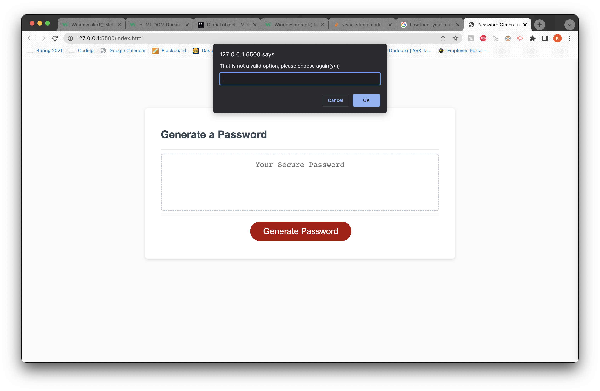

# Password-Generator

## Technologies Used

- HTML
- CSS
- Javascript
- VS Code
- Git
- GitHub

## Link to Application

https://kevinpxu.github.io/Password-Generator-JS/

## Summary

This project was used to teach myself how to code with Javascript. I learned to use numerous logical operations such as comparative operatives and functions to complete this project. This project also taught me how to utilize the built in methods such as split, concat, Math.random, and Math.floor. It also taught me how to better account for errors and how to account for invalid entries for a site.

## Screenshots


## Description

Page to generate a password of given length between 8 and 128. User will be prompted to select if they want Uppercase, Lowercase, numbers and/or symbols in their password. If an improper input is recorded, then an error message will be displayed and user will be prompted again to input a value. After all prompts are completed, a password will be alerted to the user then displayed to the screen.

## Code Snippet

### Creates a warning of invalid option is presented

```Javascript
var upperPrompt = prompt(
    "Do you want uppercase letters in your password? (y/n)"
  );
  //if the answer to prompt is not valid, it will ask them to choose a new answer.
  while (
    upperPrompt != "y" &&
    upperPrompt != "Y" &&
    upperPrompt != "n" &&
    upperPrompt != "N"
  ) {
    upperPrompt = prompt(
      "That is not a valid option, please choose again(y/n)"
    );
  }
```

### Screenshot of above code



## Author Links

[LinkedIn](https://www.linkedin.com/in/kevin-xu-4672a7215/)
[GitHub](https://github.com/KevinPXu)
