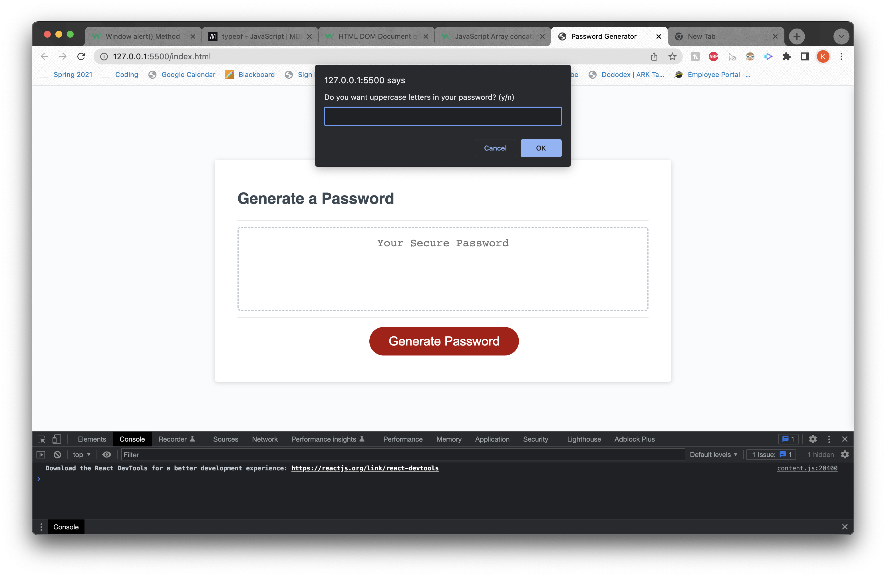
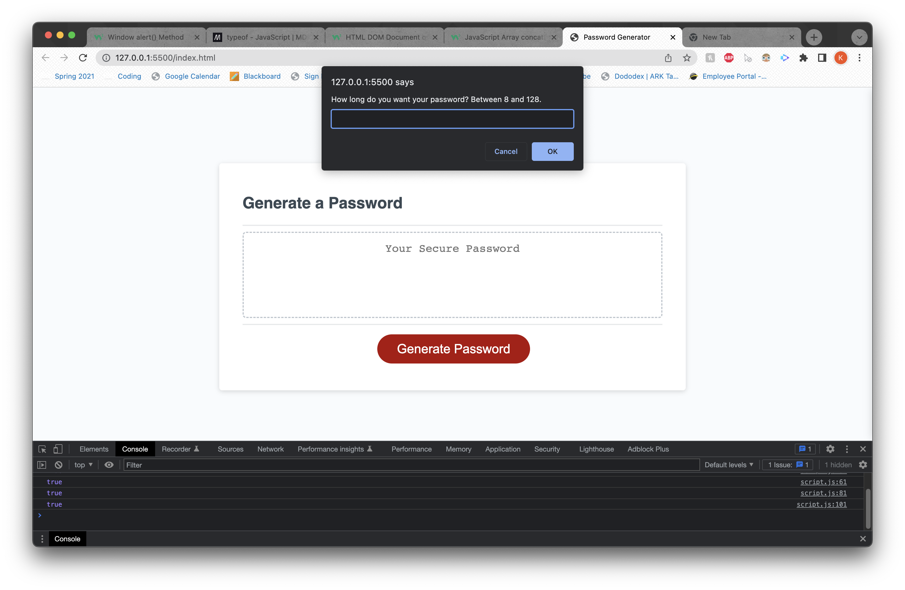
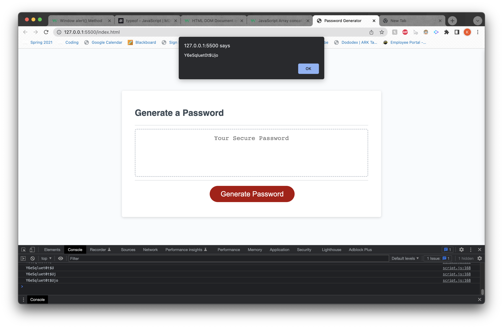
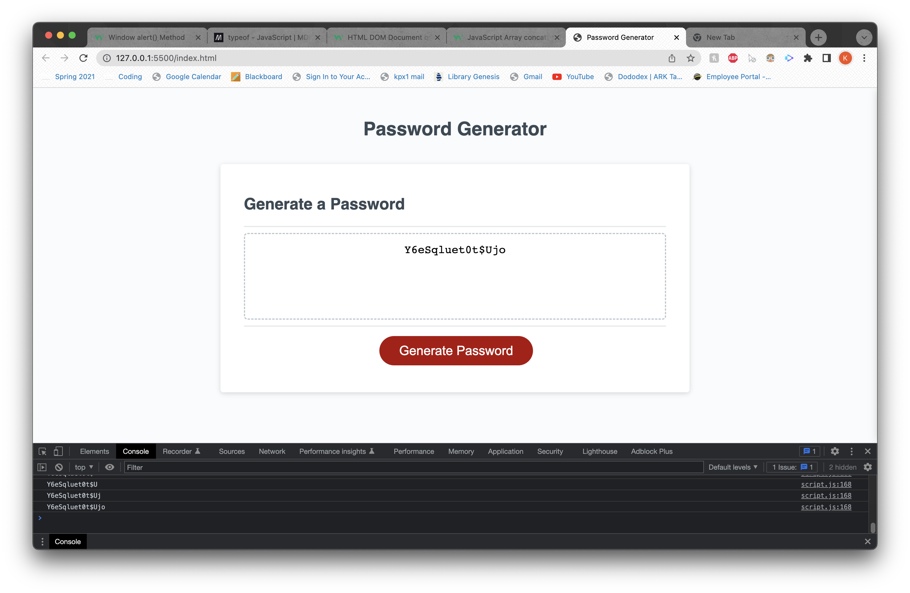

# Password-Generator

## Technologies Used

- HTML
- CSS
- Javascript
- VS Code
- Git
- GitHub

## Link to Application

https://kevinpxu.github.io/Password-Generator-JS/

## Summary

This project was used to teach myself how to code with Javascript. I learned to use numerous logical operations such as comparative operatives and functions to complete this project. This project also taught me how to utilize the built in methods such as split, concat, Math.random, and Math.floor. It also taught me how to better account for errors and how to account for invalid entries for a site.

## Screenshots






## Description

Page to generate a password of given length between 8 and 128. User will be prompted to select if they want Uppercase, Lowercase, numbers and/or symbols in their password. After all prompts are completed, a password will be alerted to the user then displayed to the screen.

## Code Snippet

### Profile picture inline text wrap

```HTML
<aside id="Biography">
          <h2>Biography</h2>

          <p class="Bio-content">
            <!-- Profile Picture -->
            
            Lorem ipsum dolor sit amet, consectetur adipiscing elit, sed do
            eiusmod tempor incididunt ut labore et dolore magna aliqua. Ut enim
            ad minim veniam, quis nostrud exercitation ullamco laboris nisi ut
            aliquip ex ea commodo consequat. Duis aute irure dolor in
            reprehenderit in voluptate velit esse cillum dolore eu fugiat nulla
            pariatur. Excepteur sint occaecat cupidatat non proident, sunt in
            culpa qui officia deserunt mollit anim id est laborum. Lorem ipsum
            dolor sit amet, consectetur adipiscing elit, sed do eiusmod tempor
            incididunt ut labore et dolore magna aliqua. Ut enim ad minim
            veniam, quis nostrud exercitation ullamco laboris nisi ut aliquip ex
            ea commodo consequat. Duis aute irure dolor in reprehenderit in
            voluptate velit esse cillum dolore eu fugiat nulla pariatur.
            Excepteur sint occaecat cupidatat non proident, sunt in culpa qui
            officia deserunt mollit anim id est laborum.
          </p>
        </aside>
```

### CSS styling for the above code to wrap profile picture

```CSS
/* settings for the profile picture, making sure it wrapped by the text*/
#Biography .Bio-content .profilepic {
  width: 100px;
  height: 150px;
  float: left;
  padding: 10px;
```

## Author Links

[LinkedIn](https://www.linkedin.com/in/kevin-xu-4672a7215/)
[GitHub](https://github.com/KevinPXu)
